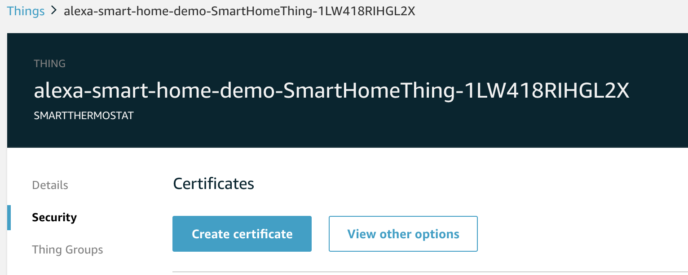

# Build a (mock) Smart Thermostat with an ESP32

In this optional section, we will wire up an ESP32 to act as a mock thermostat connected to our AWS backend. 

## Key Components

* **Red and blue LEDs** used to indicate that thermostat is in HEAT or COOL mode, respectively
* **White LED** to indicate that the device is successfully connected to your AWS IoT Core cloud backend
* **DHT11** temp/humidity sensor from which the device will take readings and send to AWS IoT
* **Push-button** to allow the user to physically change the thermostat between HEAT, COOL, and OFF

## Bill of Materials

Refer to the [ESP32 Thermostat bill of materials (BOM)](./05a-esp32-parts-list.md) for the components needed to build your mock device.

## Wire up your ESP32

The instructions and images below assume you are using the exact same ESP32 dev board that I listed above. If you are not, the pin numbers and locations may be different for your board's manufacturer, so be sure to reference their pinout diagram. 

1. Board and schematic: 

    

    Up-close (1): 
    

    Up-close (2): 
    

    Pinout (this is specific to my ESP32 manufacturer): 
    

## Flash ESP32 with thermostat skill

We will flash the ESP32 with [Mongoose OS](https://mongoose-os.com/), an open-source IoT operating system. Mongoose OS (MOS) supports C/C++ and Javascript. We will be using the Javascript version in this demo.  

## Generate and Download Device Certificates

The CloudFormation template you deployed in previous steps created an AWS IoT "Thing" for you in the device registry. A registry `thing` is only a logical representation of a physical device. In order to create a link between a physical device and your thing, you must generate certificates and keys, attach them to your thing, and install them on your device. Then, when your device connects to AWS IoT Core's MQTT pub/sub broker, IoT Core will know which thing the device is based on its certificates. 

1. Navigate to the [AWS IoT registry](https://us-east-1.console.aws.amazon.com/iot/home#/thinghub).

2. Click the thing with a name similar to  `alexa-smart-home-demo-SmartHomeThing-1LW418RIHGL2X`

3. Click **Security** on the left and then click the **Create certificate** button:

    

4. On the next screen, you should see a **Certificate created!** message. Follow these steps: 

    1. Download the device certificate and private key to the `esp32/fs` directory of your project repository. For this demo, you do not need to download the public key.

    2. Click **Activate** to activate your certificate. 

    3. Click **Attach a policy** in the lower right corner:

    

5. The CloudFormation template you launched previously has already created an IoT certificate policy for you with a name similar to `alexa-smart-home-demo-IoTThingPolicy-ABCDEFG`. Search for this policy, check the box next to it, and click **Done**:

    

## Flash ESP32 with Thermostat Code and AWS IoT Certificates
2. TODO: add instructions to flash ESP32 with contents of the /esp32 directory. 

## Configure WiFi on your ESP32
4. TODO: add instructions to configure WIFI for the ESP32

## Verify Connectivity to AWS IoT Core
After a few moments, verify that your ESP32 is connected to AWS either via the white LED or via the messages in the MOS console.

## Next Steps

Once you have your components, complete [Step 6 - Test Your Skill with an ESP32 Thermostat](./06-test-skill-with-esp32.md).